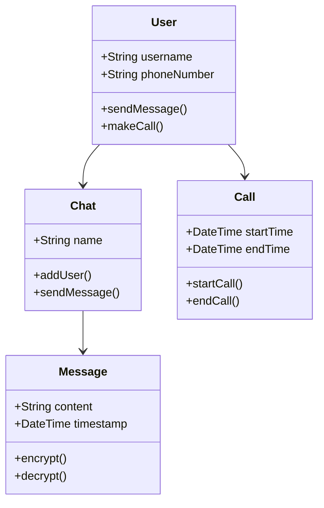
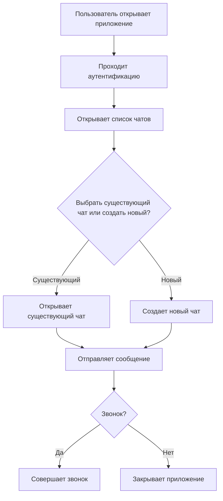
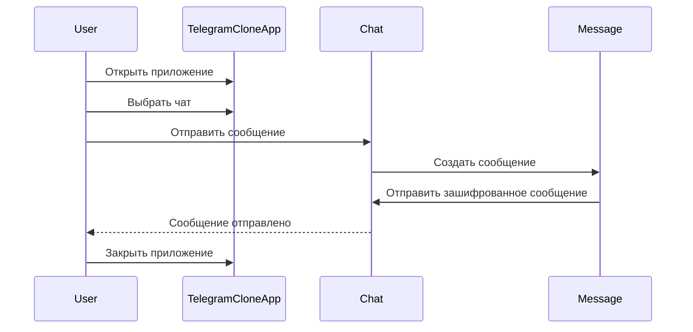

_______________________________________________________
# NikitaPetrov_Is32k

## Telegram — это мессенджер, предназначенный для обмена текстовыми и мультимедийными сообщениями, создания групповых чатов, голосовых и видеозвонков. Приложение поддерживает шифрование данных для повышения безопасности и доступно на различных платформах.

### Основные возможности
- Мгновенный обмен текстовыми сообщениями.
- Отправка фотографий, видео и файлов.
- Создание групповых чатов с неограниченным количеством участников.
- Голосовые и видеозвонки.
- Поддержка каналов для вещания информации большим группам пользователей.
- Шифрование сообщений (сквозное шифрование для секретных чатов).
- Многоуровневая система безопасности (два фактора аутентификации).
### Преимущества
- Быстрая и безопасная передача данных.
- Многофункциональные чаты с поддержкой ботов и интеграций.
- Высокий уровень конфиденциальности и защиты данных.
- Кроссплатформенная поддержка.
- Интеграция с API для разработки собственных ботов и приложений.
### UML Диаграммы
#### Диаграмма классов (Class Diagram)

##### User — класс, представляющий пользователя с методами для отправки сообщений и совершения звонков.
##### Chat — класс чата, который содержит участников и сообщения.
##### Message — класс сообщения с методами шифрования и расшифровки.
##### Call — класс для обработки голосовых и видеозвонков.
#### Диаграмма активности (Activity Diagram)

##### Диаграмма активности демонстрирует шаги пользователя, начиная от аутентификации и работы с чатами, до отправки сообщений и совершения звонков.
#### Диаграмма последовательности (Sequence Diagram)

Диаграмма последовательности показывает процесс отправки сообщения пользователем и взаимодействие между классами приложения.

_______________________________________________________
